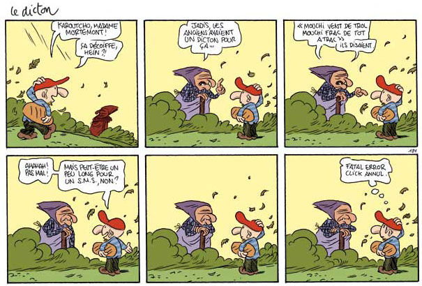
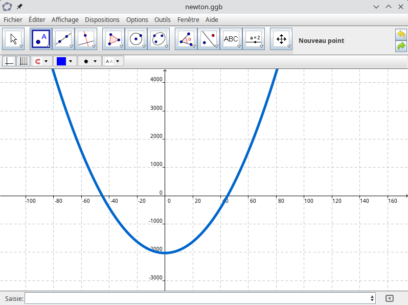
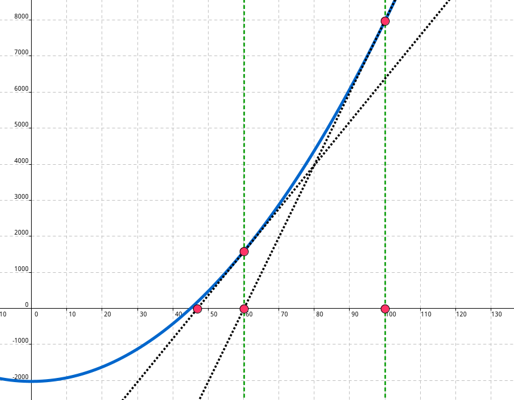

# Le Retour à la terre

**Le Retour à la terre** est une série de bande dessinée humoristique, dont le scénario décrit la vie du personnage Manu Larssinet, un dessinateur citadin qui s'est installé à la campagne avec sa compagne et son chat. 

<center>
    
</center>

Une méthode comme une autre pour décrire l'importance de savoir retrouver ses racines. 

Ce TP s'intéresse à d'autres méthodes permettant de déterminer une valeur approchée d'une racine carrée.

## La méthode de la potence

<center>
    
</center>

### Avec un exemple 

On retrouve une méthode d'**extraction de racine** dans un ouvrage du mathématicien indien **Âryabhata** vers 499 après J.-C.  
Elle a été utilisée jusqu'au milieu du XX$^\text{ème}$ siècle, avant l'invention des calculateurs électroniques.

On cherche à déterminer à la main, une valeur approchée à deux décimales de $\sqrt{73\;605}$.

- On commence par réaliser une potence comme ci-dessous :

$$
\begin{array}[t]{m{5cm}c}
    \begin{array}[t]{l}
        73\;605\hspace{1cm}\\
    \end{array}
    &
    \begin{array}[t]{|c}
        \hspace{0.5cm}?\hspace{0.5cm}\\
        \hline
        \\
        \\
        \\
        \\
    \end{array}
\end{array}
$$

- On sépare ensuite le nombre $73\;605$ en tranches de deux chiffres à partir de la droite.  
La dernière tranche pouvant n'avoir qu'un seul chiffre :

$$
\begin{array}[t]{m{5cm}c}
    \begin{array}[t]{l}
        \fbox{7}\fbox{36}\fbox{05}\hspace{1cm}\\
    \end{array}
    &
    \begin{array}[t]{|c}
        \hspace{0.5cm}?\hspace{0.5cm}\\
        \hline
        \\
        \\
        \\
        \\
    \end{array}
\end{array}
$$

- On détermine maintenant le plus grand entier $x$ dont le carré est inférieur ou égal à la première tranche.  
Ici, il s'agit de $2$ car $3^2 > 7$. On inscrit ce nombre à la place du diviseur. Il s'agit du premier chiffre de $\sqrt{73\;605}$.  
On appelle ce nombre **la racine**.

$$
\begin{array}[t]{m{5cm}c}
    \begin{array}[t]{l}
        \fbox{7}\fbox{36}\fbox{05}\hspace{1cm}\\
    \end{array}
    &
    \begin{array}[t]{|c}
        \hspace{0.5cm}2\hspace{0.5cm}\\
        \hline
        \\
        \\
        \\
        \\
    \end{array}
\end{array}
$$

- On soustrait alors le carré de ce nombre à la première tranche puis on abaisse la tranche suivante.

$$
\begin{array}[t]{m{5cm}c}
    \begin{array}[t]{rrr}
        7&36&05\hspace{1cm}\\
        -4&&\\
        \hline
        3&36&
    \end{array}
    &
    \begin{array}[t]{|c}
        \hspace{0.5cm}2\hspace{0.5cm}\\
        \hline
        \\
        \\
        \\
        \\
    \end{array}
\end{array}
$$

- On cherche à présent le plus grand chiffre $k$ pour lequel l'expression $(20r+k)\times k$ est inférieure ou égale au nombre abaissé avec $r$ le nombre en haut à droite de la potence.

$$
\begin{array}{|l|c|c|c|c|c|c|c|c|c|}
\hline
    k & 0 & 1 & 2 & 3 & 4 & 5 & 6 & 7 & 8\\
\hline
    20\times 2+k & 40 & 41 & 42 & 43 & 44 & 45 & 46 & 47 & 48\\
\hline
    (20\times 2 + k)\times k & 0 & 41 & 84 & 129 & 176 & 225 & 276 & 329 & 384\\
\hline
\end{array}
$$
  
- 0n choisit le chiffre $7$ que l'on inscrit dans la racine, on soustrait $329$ au nombre abaissé puis on abaisse une nouvelle tranche.

$$
\begin{array}[t]{m{5cm}c}
    \begin{array}[t]{rrrr}
        7&36&05&\hspace{1cm}\\
        -4&&\\
        \hline
        3&36&\\
        -3&29&\\
        \hline
        &7&05
    \end{array}
    &
    \begin{array}[t]{|l}
        \hspace{1cm}27\\
        \hline
        47\times 7 = 329\\
        \\
        \\
        \\
    \end{array}
\end{array}
$$

- On répète l'opération précédente avec le nouveau $r$ (qui vaut $27$) :

$$
\begin{array}{|l|c|c|c|}
\hline
    k & 0 & 1 & 2\\
\hline
    20\times 27+k & 540 & 541 & 542\\
\hline
    (20\times 27 + k)\times k & 0 & 541 & 1084\\
\hline
\end{array}
$$

- Le chiffre retenu est $1$ et la potence devient :

$$
\begin{array}[t]{m{5cm}c}
    \begin{array}[t]{rrrr}
        7&36&05&\hspace{1cm}\\
        -4&&\\
        \hline
        3&36&\\
        -3&29&\\
        \hline
        &7&05\\
        &-5&41\\
        \hline
        &1&64
    \end{array}
    &
    \begin{array}[t]{|l}
        \hspace{1cm}271\\
        \hline
        47\times 7 = 329\\
        541\times 1 = 541\\
        \\
        \\
        \\
        \\
    \end{array}
\end{array}
$$

- On peut poursuivre l'extraction en ajoutant une tranche $00$ et en mettant une virgule à la racine.

$$
\begin{array}[t]{m{5cm}c}
    \begin{array}[t]{rrrrr}
        7&36&05&&\hspace{1cm}\\
        -4&&\\
        \hline
        3&36&\\
        -3&29&\\
        \hline
        &7&05\\
        &-5&41\\
        \hline
        &1&64&00
    \end{array}
    &
    \begin{array}[t]{|l}
        \hspace{1cm}271,3\\
        \hline
        47\times 7 = 329\\
        541\times 1 = 541\\
        5423\times 3 = 16\;269\\
        \\
        \\
        \\
    \end{array}
\end{array}
$$

### À vous de jouer

1. Déterminez une valeur approchée à trois chiffres après la virgule de $\sqrt{2026}$.
2. Téléchargez le script python suivant en cliquant sur [ce lien](<./files/racine.py>)
3. Exécutez le script et testez l'instruction `decoupe_en_tranche(2026)`.
4. Corrigez la fonction `decoupe_en_tranche` pour obtenir des tranches de deux chiffres.
5. Associez chacune des étapes de l'algorithme d'extraction aux différentes instructions de la fonction `extraire_racine`.  
On pourra remplir le tableau :

$$
\begin{array}{|c|c|}
    \hline
    \textbf{Étape de l'algorithme} & \textbf{Lignes associées}\\
    \hline
    \text{Découpe en tranches} & \text{Ligne 9}\\
    \hline
    \text{Recherche de } x & \\
    \hline
    \text{Recherche du chiffre } k & \\
    \hline
\end{array}
$$

## La méthode de Héron

<center>
    
</center>

La **méthode de Héron** ou **méthode babylonienne** est une méthode efficace d'obtention de valeurs approchées de racines carrées. Elle porte le nom du mathématicien Héron d'Alexandrie, qui l'expose dans son ouvrage Metrica, découvert seulement en 1896.

Elle consiste à déterminer une suite récurrente qui converge vers la racine recherchée.

Par exemple, pour déterminer une valeur approchée de $\sqrt{2\;026}$, on s'intéresse à la suite $(x_n)$ définie par :

$$
\left\lbrace\begin{array}{rcl}
x_0 & = & 100\\
x_{n+1} & = & \frac{1}{2}\left(x_n + \frac{2026}{x_n}\right)
\end{array}\right.
$$

Le script suivant, que vous pouvez télécharger en suivant [ce lien](<./files/heron.py>), définit la fonction `x` qui renvoie
les valeurs de la suite $(x_n)$.

``` python title="Implantation de la suite (x_n)" linenums="1"

def x(n):
    res = ...
    
    for k in range(n):
        res = ...
        
    return res
```

1. Complétez le script et vérifiez que $x(1) = 60.13$.
2. Testez l'instruction `[x(n) for n in range(10)]` et conjecturez le sens de variations de la suite.

Pour justifier que la suite $(x_n)$ est convergente, on introduit la fonction $f$ définie sur $]0;+\infty[$ par 

$$f(x) = \frac{1}{2}\left(x + \frac{2026}{x}\right)$$

1. Rendez vous sur le site [xCas en Ligne](https://www.xcasenligne.fr/jcas/index.html){:target="_blank" }.
2. Définissez la fonction $f$ à l'aide de l'instruction $f(x) := (1/2)*(x+2026/x)$
3. Testez les instructions suivantes :

    $$
    \begin{array}{cccc}
        \text{limit}(f, x, 0, 1) & \text{limit}(f, x, +\text{inf}) & \text{simplifier}(f'(x)) & \text{resoudre}(f'(x) > 0)
    \end{array}
    $$

4. Déduisez-en le tableau de variations complet de $f$ sur l'intervalle $]0;+\infty[$.
5. Démontrez par récurrence que pour tout entier naturel $n$ :

    $$
        \sqrt{2026} \leqslant x_{n+1} \leqslant x_n
    $$

    et en déduire que la suite $(x_n)$ est convergente.

## La méthode de Newton

<center>
    
</center>

La méthode de Newton part du constat que la valeur $\sqrt{2026}$ est solution de l'équation $x^2-2026 = 0$.  
L'idée est donc de déterminer une méthode permettant de retrouver les solutions d'une équation de la forme $f(x) = 0$.

1. Commencez par récupérer le fichier Géogébra en cliquant sur [ce lien](<./files/newton.ggb>).

La courbe de ce fichier correspond à la fonction $f : x \mapsto x^2-2026$.

<center>
    
</center>

2. Placez un point situé sur la valeur $x_0 = 100$ de l'axe des abscisses.
3. À l'aide d'une perpendiculaire, retrouvez le point de la courbe $\mathcal{C}_f$ d'abscisse $100$.
4. Tracez la tangente à la courbe au niveau de ce point. Cette tangente coupe l'axe des abscisses en une certaine valeur $x_1$.
5. Recommencez jusqu'à l'obtention de la valeur $x_2$.  

<center>
    
</center>

On note donc $x_0 = 100$ et on cherche à déterminer $x_1$.  
$x_1$ correspond à l'intersection de l'axe des abscisses et de la tangente à $\mathcal{C}_f$ en $x_0$.  

1. Vérifiez que l'équation de la tangente à $\mathcal{C}_f$ en $x_0$ est donnée par :

    $$
        (T_0) : y = 200x - 12\;026
    $$

2. Déduisez-en que $x_1 = \frac{12\;026}{200} = 60,13$.

3. On suppose que l'on a construit la suite jusqu'au terme $x_n$ et on s'interroge sur la valeur de $x_{n+1}$.  
Démontrez que l'équation de la tangente à la courbe $\mathcal{C}_f$ en $x_n$ est donnée par :

    $$
        (T_n) : y = 2x_nx-x_n^2-2026
    $$

4. Déduisez-en que $x_{n+1} = \dfrac{x_n^2+2026}{2x_n}$ et vérifiez que $x_{n+1} = \frac{1}{2}\left(x_n+\frac{2026}{x_n}\right)$ (Incroyable n'est-ce pas ?).

<center>
    
</center>